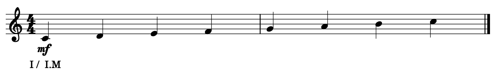
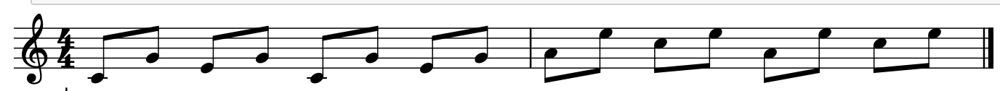

.. _user-guide:

User's guide
============

This guide is here to help you write music with musiclang.


General considerations
----------------------

- All the object in musiclang are immutable, a method call on an object will return a new instance of the object.
- Each part can only play a monophonic melody
- The string representation of a score fully determines it. It means that if you import the library : ``eval(str(score))==score``
- There are many already instantiated object that you can call on the ``musiclang.library`` module. It stores for example chords and notes symbols
- Played notes are always relative to a chord scale

To illustrate these two last points :

Example : Write a scale
````````````````````````

Here is a simple script to show the C-major scale in musiclang ::

    from musiclang.library import *

    score = (I % I.M)(piano__0=s0 + s1 + s2 + s3 + s4 + s5 + s6 + s0.o(1))

    score.show()




If we wanted to write the V of C-major (note that the first note is the root of the chord) ::


    from musiclang.library import *

    score = (V % I.M)(piano__0=s0 + s1 + s2 + s3 + s4 + s5 + s6 + s0.o(1))

    score.show()


To write the Eb major scale we could have done ::

    from musiclang.library import *

    score = (I % III.b.M)(piano__0=s0 + s1 + s2 + s3 + s4 + s5 + s6 + s0.o(1))

    score.show()


If we wanted to write this time the (harmonic) minor scale of D ::


    from musiclang.library import *

    score = (I % II.m)(piano__0=s0 + s1 + s2 + s3 + s4 + s5 + s6 + s0.o(1))

    score.show()


.. image:: ../images/d_minor_scale.png
  :width: 600
  :alt: D harmonic minor scale


Write symbolic music
---------------------


MusicLang uses its own notation language to write music.
To write a basic MusicLang score that can be translated to midi or any other format you need
two ingredients :

- Define the chords scale of your song
- Define which part (with instrument name) plays which monophonic melody

This feature ensures that you write your music with as much context as possible. In that way you can really use
advanced manipulations on your music.


Write notes
````````````

**The specificity of MusicLang is that notes are always represented relatively to a chord inside a tonality.**

Usually you won't be instantiating notes yourself but use the builtin ``musiclang.write.library`` which already
defines common symbols of musiclang. See the examples to get familiar with the notation library.

.. warning:: Notes are 0-indexed relative to a scale, so for example ``s0`` is the first note of the scale.

There are different kinds of notes

- Scale notes : ``s0, s1, s2, s3, s4, s5, s6`` : relative to 7 sounds scale of the chord inside a tonality
- Chromatic notes : ``h0, h1, h2, h3, h4, h5, h6, h7, h8, h9, h10, h11`` : relative to the 12 sounds of the chromatic scale associated with the chord/tonality
- Relative up scale note, ``su0, su1, su2, su3, su4, su5, su6`` : Up relatively to the previous note of a melody
- Relative down scale note, ``sd0, sd1, sd2, sd3, sd4, sd5, sd6`` : Down relatively to the previous note of a melody
- Relative up chromatic note, ``hu0, hu1, hu2,  hu3, hu4, hu5, hu6, hu7, hu8, hu9, hu10, hu11`` : Up relatively to the previous note of a melody
- Relative down chromatic note, ``hd0, hd1, hd2,  hu3, hu4, hu5, hu6, hu7, hu8, hu9, hu10, hu11`` : Down relatively to the previous note of a melody

Octaves
'''''''''''''

You can specify an octave using the :func:`~o` method of a note
For example : ``s0.o(1)`` is ``s0`` up one octave, ``s0.o(-1)`` is ``s0`` down one octave

Rhythm
'''''''''''''

You can spcify a rhythm to a note using properties

- ``h=half, w=whole, q=quarter, e=eight, s=sixteenth, t=thirty-seconds``. By default the duration is a quarter so ``s0==s0.q``
- You can use n-uplet ``(3, 5, 7)`` : for example ``s0.e3`` is s0 with a duration of a triolet etc ...
- You can use dots with ``d`` : For example s0.qd has a dotter quarter duration. You can use double dots. eg : ``s0.ed`` for a dotted eight note
- You can use the :func:`~Note.augment` method if you want a custom duration that can't be notated easily. For example ``s0.augment(8)`` for a duration of two whole notes)

.. note:: You must use the builtin python `fractions.Fraction` object to create duration otherwise you will get rounding errors when exporting to midi.

Dynamics
'''''''''''''

You can add dynamics to a note using ``ppp, pp, p, mf, f, ff, fff`` properties of the note
Example : s0.fff is a note in triple forte

Silences
'''''''''''''

You can specify a silence using the ``r`` notation in the library, otherwise use the Silence class

Continuation
'''''''''''''
You can specify a note continuation using the ``l`` notation in the library, otherwise use the Continuation class

Mode
''''

You can force a mode on a note that bypass the mode of the chord scale (same as tonalities modes)

For example ::
    from musiclang.library import s0, s1, s2, s3, s4, I
    score = (I%I.M)(piano=s0 + s1 + s2 + s3.lydian + s4)

    score.show()


Examples
'''''''''
>>> from musiclang.library import s0, s1, s2, I

You can learn what pitch is associated to a note in the context of a chord :

>>> chord = (I % I.M) # C major chord (first degree of first major tonality relative to C)
>>> note = s0
>>> chord.to_pitch(s0)
0

>>> chord.to_pitch(s1)
2

>>> chord.to_pitch(s2)
4

0 is the note C5 in musiclang, so 2 is D5

>>> (I % I.m).to_pitch(s2)
3

In minor s2 is eb (=3)


Write a melody
``````````````

A melody is a time sequence of notes. It can only be monophonic. It is played by a part on a chord scale
Without a chord scale a melody does not define pitches. It only defines degrees on a chord scale.
It allows you to reuse a melody in a different chord (transposition invariance). For example ::

    from musiclang.library import *

    alberti_bass = (s0 + s4 + s2 + s4).e * 2

    score = (I % I.M)(piano=alberti_bass) + (VI % I.M)(piano=alberti_bass)

    score.show()




A melody implements common python operator to ease the writing of melodies :

- ``+`` : A a note to a melody or concatenate two melodies in time
- ``&`` : Transpose a melody diatonically (will change the value of notes)
- ``.<method>`` : Call any method of note to apply it on each note of the melody


Write tonalities
````````````````
Tonality is a roman numeral with an optional accident (b or s) and a mode.
The degree is relative to the C-major scale. So ``IV.s`` is an F sharp tonality

For the modes :
- ``M`` refers to the major mode
- ``m`` refers to the harmonic minor mode
- ``mm`` refers to the harmonic minor mode
- ``dorian`` refers to the dorian mode (C, D, Eb, F, G, A, Bb) in C
- ``phrygian`` refers to the dorian mode (C, Db, Eb, F, G, Ab, Bb) in C
- ``lydian`` refers to the lydian mode (C, D, E, F#, G, A, B) in C
- ``mixolydian`` refers to the mixolydian mode (C, D, E, F, G, A, Bb) in C
- ``aeolian`` refers to the aeolian mode (C, D, Eb, F, G, Ab, Bb) in C
- ``locrian`` refers to the locrian mode (C, Db, Eb, F, Gb Ab, Bb) in C

Tonalities can have an octave with the ``o`` method.

Write chords scales
`````````````````````

General structure of a chord
'''''''''''''''''''''''''''''

A chord is structured the following way : ``<degree> % <tonality>``
The chord can have an octave with the ``o`` method.


Modulation
'''''''''''

You can use the ``%`` again to modulate on another tonality.
For example ``(V % I.M) % V.M`` Is the V/V in C major which is a Dmajor chord.
When you modulate in a new tonality the final degree will be the addition of the two degrees
and the new mode will be the mode at the right. For example ``(I % II.M) % II.m = (I % III.m)``.


Instruments
''''''''''''

You can use any instrument of the general midi list (https://en.wikipedia.org/wiki/General_MIDI) :

- with _ (underscores) instead of spaces.
- In lowercase

.. note:: To specify the part number of an instrument you can use the __<part_idx> notation. For example ``violin__0`` means the part 0 of the violin instrument.


Output a musiclang score into another format
----------------------------------------------

You can output a MusicLang score in various ways. There are four main methods on the ``Score`` object :

- ``to_pickle`` : Save the score to a pickle object
- ``to_midi`` : Save the score to a midi object
- ``to_mxl``: Save the score to a musicxml format (For example for musescore)
- ``show``: This is for the time being a wrapper for the music21 show method

For example the ``to_midi`` method ::

 from musiclang.library import *

 score = (I % I.M)(piano=[s0, s2, s4]) + (V % I.M)(piano=[s2.o(-1), s4.o(-1), s0])

 score.to_midi('filepath.mid')


Read an existing file (Analyze music)
--------------------------------------

The score loader is decomposed in two parts :

- A chord analyzer that split the music in relevant chord scales
- A parts analyzer that split the music in different monophonic parts

Here is a script that allows you to read a midi file called music.mid ::

    from musiclang import Score

    score = Score.from_midi('music.mid')


Transform music
---------------

.. warning:: As of the time of the beta, the transform library is still not released.


Predict music
-------------

.. warning:: As of this time, the predict library is only partially released. You can train a model but you cannot use an already trained one.

The ``musiclang.predict`` module will store many classes that will help you predict some
aspect of an already existing MusicLang score using models trained on a variety of musical data.

See the :ref:`examples-gallery` for some detailed examples.


Examples
---------

See the :ref:`examples-gallery`.


